# 2D graphics in C

This is a project about 2D graphics, with a library of functions written in C and with some demo-scripts written in lua, though there is a possiblity of generating the C/native bindings in different languages.

The primary purpose of this was to learn about graphical methods and learn about modern C, though I'm professionally a java programmer, so a lot of the code probably looks like java. 

# TODOs (coding related)
## Part 1 (Images/pixels)
* support for alternative color spaces

## Part 2 (Linear algebra)
* interpolation - for affine transforms - nearest neighbor, linear, bilinear, etc.
** I think the steps are: invert the affine xform matrix, use interpolation method + inverted matrix to map new pixel back to old image location.

## Part 3 (shapes)
* ~~vector graphics - drawing arcs~~
** optimized (midpoint) algorithm required
* draw filled images - shape.h methods
** solid and gradient fill
* sampling - aliasing and antialiasing
* gradients (linear and radial)

# TODOs (polishing/productionalizing)
* update makefile to be "better"
* compile with clang 
* clean up readme
* clean up git history
* add in flags for optional compilation of jpg or png
* clean up/add missing unit tests

# Setup 
You need to install the basic C build tools. 

On Ubuntu the command to run is `sudo apt-get install build-essentials` to download gcc (the C compiler I tested against).

## Dependencies
The other dependencies for the project are: 

* lua 5.2 - for running the lua scripts 
* libjpg - for reading jpgs and writing images as jpgs
* libpng - for reading pngs and writing images as pngs 
* clang-format (only for formatting) and clang-lint (for linting)
* swig 4.0.2 - for generating the lua bindings for running the lua scripts

In theory you can get this to run without these dependencies, but some stuff will need to be cleaned up/removed. 

## IDE 

I recommend installing `VS Code` since its both pretty light-weight, but also has plugins for C. 
`vim` is another alternative. 

## Setup commands

The simplest command to build everything is `make all` which will compile and link all files. Then you can run the main application with `./bin/graphics`. 

`make everything` will also build the lua bindings and `make target` will also run the formatter and linter. You can run all the sample lua scripts by running `./run_lua_scripts.sh`. 

# Image basics 

## Color and pixels

The color model that computers work with is an additive color model, with the base colors being red, green, and blue. 
A pixel is made of a 3-tuple of these colors to light up a portion of the screen. Adding more colors together would make something lighter, and adding all of them together makes white. The absence of any color leaves a black pixel. 

A pixel uses a tuple of RGB, with a possible 4th value for 'alpha' (basically transparency). Each color has a 'depth' which is how many possible values there are for that color.
e.g. if a pixel had a red depth of 2, then the pixel could either be red or not. I'm going to use 1 byte for each color for each pixel, mostly because I'm making small images and just testing stuff out, but trying different values can be interesting.

In this project, a pixel will be a 4-tuple with values each element value rangings from 0-255 (or 0 - 0xFF in hex).  
This means that a pixel will take up to 4 bytes (32 bits) which is a little big. 

And as a side note, an alpha of 255 is not transparent and an alpha of 0 is fully transparent.

TODO: images for pixel colors. RGB, mixed, and half-alpha

| Description | Pixel Values | Example image |
|--|--|--|
|Red|(255, 0, 0, 255)|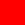|
|Blue|(0, 255, 0, 255)|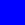|
|Green|(0, 0, 255, 255)|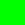|
|Grey|(128, 128, 128, 255)||
|Half transparent grey|(128, 128, 128, 128)||
|Black|(0, 0, 0, 255)|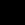|
|White|(255, 255, 255, 0)||

### Implementation - Pixel struct

I'm using a simple struct to represent a pixel. Its a more object-oriented approach (which I'm more familiar with) and you can do stuff like pixel.red / pixel->red instead of pixel\[RED\]. 
The downside of doing it this way is that it it makes it harder to do vectorized optimizations to the algorithms. I'm not super worried about this because I'm already doing a ton of unoptimized stuff - e.g. the PAM file format I'm using is pretty inefficient. 

the implementation can be found in [pixel.h](./src/pixel.h#11). Its not the greatest practice to have the struct definition (it leaks the implementation of the struct) in the header files, but in this case I think its fine - its not going to change, and it makes it easier to use the pixel objects from an API consumer viewpoint. The only downside of my approach is if I want to change the struct later - like if I wanted to convert it to an array-based implementation as I would not easily be able to do the change. 

## Color operations

Pixels can be thought of as 3-Vectors (the linear algebra vector) in color space, with red, green and blue being the orthogonal basis vectors.

The two basic vector operations are:
* add two vectors (adding two pixel values together by color, so p1.red + p2.red, p1.blue + p2.blue...)
* multiply the vector by a constant 

There are also additional operations that I've added support for: multiplying the color values by a matrix. 

Multiplying a pixel by a matrix is used in simple white balance algorithms. This is to correct for weird lighting (or to make weird lighting) e.g. if everything has a small red tint, you can multiply by a matrix like:

```
0.9 0 0
0   1 0
0   0 1
```

to correct for it

| Description | Operation (all use 255 as alpha) | Image |
|--|--|--|
|Adding red and green | (255, 0, 0) + (0, 255, 0) | 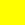 |
|Adding red, green and blue | (255, 255, 0) + (0, 0, 255) |  |
|Subtracting green from white|(255, 255, 255) - (0, 255, 0) |  |
|Dividing bright purple by 2| (255, 255, 0) / 2| 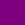 |

TODO: multiply by matrices -> identity, sum colors (proj. to greyscale), swap colors, rebalance colors (increase one, decrease others), only get 1 colors (i.e. G&B multiply by 0)

|Description|Original Pixel Value (all alpha = 255)|Original image|Transformation Matrix|Transformed Pixel Value| Transformed Image|
|--|--|--|--|--|--|
|No change (identity)|(255, 255, 255)||1 0 0<br/>0 1 0<br/>0 0 1|(255, 255, 255)||
|Greyscale projection|(0, 255, 255)| 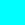| 1/3 1/3 1/3<br/>1/3 1/3 1/3<br/>1/3 1/3 1/3| (170, 170, 170)| |
|Swap colors (R&G)|(0, 255, 255) | | 0 1 0<br/>1 0 0<br/>0 0 1<br/> | (255, 0, 255) | 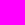 |
|Filter color (Only select G&B) | (255, 255, 255)| | 0 0 0<br/>0 1 0</br>0 0 1<br/>| (0, 255, 255) |  |
|Rebalance colors (decrease red, increase blue)| (128, 128, 128) |  | 1/2 0 0<br/>0 1 0<br/>0 0 3/2 | (64, 128, 192) |  |

The matrix pixel operations can also be combined. In Linear Algebra terms whats happening is we're taking matrix A and multiplying pixel p by it (so output_color = A * p). You can make a new matrix C by multiplying matrices A and B that can do both transformations in 1 step (though since its matrix multiplication order matters and A * B doesn't always equal B * A).

|Description|Original Pixel Value (all alpha = 255)|Original image|Transformation Matrix|Transformed Pixel Value| Transformed Image|
|--|--|--|--|--|--|
|Filter (R&B) then greyscale|(128, 128, 128)| | 0 1/3 1/3<br/>0 1/3 1/3<br/>0 1/3 1/3<br/>| (83, 83, 83) | |
|Greyscale then filter|(128, 128, 128)| | 0 0 0<br/>1/3 1/3 1/3<br/>1/3 1/3 1/3<br/>| (0, 128, 128) | |


TODO: invertable operations

### Implementation - signed, unsigned, overflow and underflow

One thing to keep in mind is over and underflow (and signed-ness of bits)

I'm using unsiged 8-bit ints for representing my colors and due to how math works on computers, adding two numbers that would be greater than 2^8 - 1 would result in the operation "overflowing" and wrapping around. See the below example (assuming little endian).

```
x = 150; //10010110
y = 150; //10010110

Adding these together would get:
100101100, but the most significant bit gets chopped off as you can only keep 8, so you end up with 00101100 [44]
```

In image processing you clamp at the max/min values, as this overflow behavior is not desired. I defined special math functions that check for over and underflows the max or the min value for the color (255 or 0 respectively). 

I've created fun custom functions for this (which are probably quite ineffecient) in [math.c](./src/math.c).

## Alternative color spaces

Color spaces are the ways of representing the colors as a tuple. The most common color space (to lay-people and me) is probably RGB, where the elements in the tuple represent the amount of red, green and blue of the pixel.

There's other color spaces though, with one example being HSV.

The HSV model is supposed to more accurately match with how humans see color. 

The hue value is the color portion of the model, with values between 0 and 360 degrees. 

Saturation is a percentage value (between 0 and 100, or 0 and 1) which is the amount of "color" in the color. 0 represents grey and 1 (or 100) represents.

Finally the value part of the model is a percentage and represents the brightness of the pixel. 0 is completely black and 1 is completely white. 

There's other color models, with other pros/cons (e.g. CMY (cyan, magenta, yellow) which is used in printers) but I'm not going to implement those. 

TODO: Example HSV colors
|Description| HSV Value | Pixel (RGB) Value | Image |
|--|--|--|--|
||||

## Images, coordinates and raster graphics 

Images can be made up of a collection of shapes (vector graphics) or a collection of pixels (raster graphics). 

Raster graphics are somewhat more common as a lot of image sensors (like in digital cameras) are made up of rows and columns of pixels. See below for an example matrix: with pixel, x-coord, y-coord.

```
p00 p01 p02
p10 p11 p12
p20 p21 p22
```

## Images

I've defined an image struct, which has a width, height and then an array of pixels to store the actual image definition.

Images can have the following functions:
* TODO
* 

### Image struct

## Alpha Blending (To move to the image section or color section)

Alpha blending is the process of combining translucent foreground and background images which produces a new image. 

This is done by taking the foreground images transparency "alpha value" and combining it with its RGB values and then combining those values with the background images RGB & alpha values. 

The formula for this computation is in the alpha_blend method in [image.c](./src/image.c).

|Description|Image|
|--|--|
|Unblended red image| 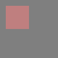|
|Unblended green image| 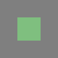|
|blended green onto red | 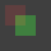 |
|blended red onto green | 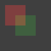 |

## Graphics file format

The final topic for the initial commit is picking a graphics file format. I want to be able to write out to a file to generate an image (I'm developing remotely over SSH, so I can't just see the image on the screen). I did a very small amount of research, found an open standard which seems really easy to write (the PAM format).  

### BMPs (not supported)

### PAM 
The pam format is a relatively easy format to write. It has a simple header and then a blob of data to represent the image. More information about the header can be found here: http://manpages.ubuntu.com/manpages/bionic/man5/pam.5.html

The downsides of the PAM format is almost no image tools support this format (not even GIMP!). You'll need to fiddle around with the [netpbm package](http://netpbm.sourceforge.net/) to install the conversion tools.

There's a converter util to convert these files to png files called pamtopng which can be found as part of the netpbm package. See [pamtopng](https://manpages.debian.org/experimental/netpbm/pamtopng.1.en.html).

I didn't go with some of the more standard file formats (bmp, png) as the header is kind of complicated and they're kind of tricky to write.

### JPEGs

### PNGs

## Image masking

# Linear algebra

## Matrix operations on pixels

Pixels can be thought of as 3 or 4 vectors (depending on whether you want to keep the alpha value). This means that you can use linear algebra and matrix multiplication to do various operations.

Some of them are as follows:

|Use case | Matrix | Description |
|--|--|--|
|Do nothing | [1 0 0]</br>[0 1 0]</br>[0 0 1] | Use the identity matrix to do nothing |
|Get the value of a specific channel| [1 0 0]</br>[0 0 0]</br>[0 0 0] | Just gets the red channel |
|Greyscale conversion | [1 1 1]</br>[1 1 1]</br>[1 1 1] | Sums up the RGB channels and then distributes the values to each channel (you also need to divide by 3) |
|Reverse colors | [0 0 1]</br>[0 1 0]</br>[1 0 0] | Reverses the R and B color values |

Output colors can be found below:

  

## Matrix operations on images

I also want to be able to support pixel operations on images. This can be done pretty easily in C by passing a function pointer.

## Linear Transformations

## Affine Transforms

Affine transformations are matrix operations on an image, but they act on the pixel locations instead of the pixel color values. 

Below are the following main types of affine transforms

| Type | Matrix | Description | Image |
|--|--|--|--|
|Identity | [1 0 0]<br/>[0 1 0]<br/>[0 0 1]<br/> | Returns the same |  |
| Translation | [1 0 Vx]<br/>[1 0 Vy]</br>[0 0 1] | Translates each pixels over by (Vx, Vy) | |
| Reflection | [-1 0 0]<br/>[0 1 0]<br/>[0 0 1] | Reflects the image over the X axis |  |
| Scale | [2 0 0]<br/>[0 1 0]<br/>[0 0 1] | Doubles the image on the X axis |  |
| Rotate | [cos(x) -sin(x) 0]<br/>[sin(x) cos(x) 0]<br/>[0 0 1]<br/> x=PI/4| rotates the image by x | |
| Shear | [1 x 0]<br/>[0 1 0]<br/>[0 0 1] OR <br/> [1 0 0]<br/>[y 1 0]<br/>[0 0 1] | Shears each point. You need to use matrix multiplication to shear on two axis with one matrix  | |

If you want to apply multiple transforms, then you can multiply the matrixes together. The operation is `T1 * T2 * v`, which can be performed as both `(T1 * (T2 * v))` or `((T1 * T2) * v)`.

There seems to be one issue - mapping from the original location to the destination location seems to create a lot of empty space when scaling up (or rotating by a non-90 degree increment or sometimes by shearing). I want to try inverting the matrix and then converting from dest to source location. 

## Better image scaling functions
Nearest neighbors, linear, bilinear, bicubic traformations

### Kernels in Image Processing

Kernels can be used in image processing to do blurring, sharpening, embossing, and edge detection. This is accomplished by doing a convolution between an image and a kernel.

Below are the following kernel transforms I've tested

|Operation|Kernel|Image|
|--|--|--|
|Identity|[0 0 0]<br/>[0 1 0]<br/>[0 0 0]|  |
|Box blur | [1 1 1]<br/>1/9 * [1 1 1]<br/>[1 1 1] |  |
|Gauss blur | [1 2 1]<br/>1/16 * [2 4 2]<br/>[1 2 1] |  |
|Sharpen | [0 -1 0]<br/>[-1 5 -1]<br/>[0 -1 0]<br/> |  |

Edge detection can also be performed, though I used a greyscale image for this:

 

The edge detection algorithm highlights only sections where there is a transition from one color to the next.

There is a slight implementation defect in the kernel transforms where I didn't account for the edges, but they can be removed after the fact, by selecting (1,1) to (width-1, height-1). Other ways to fix it would be to either mirror or wrap the pixels in the image.

# Vector graphics and rasterization

Vector graphics are a different way of representing images. I've currently been representing images as a 2D array of pixels (called raster graphics). Its easy and flexible, but requires a lot of memory, and doesn't always provide the easiest API to work with if you want to draw shapes.

Another way of representing images is with a collection of shapes, called vector graphics. These primarily have the advantage of being scalable to any size with no aliasing. They may also take less storage space if the image is made out of simple shapes. The downside of vector graphics is that most digital image capture technology does not capture vector images (i.e. a digital camera captures an array of 2D pixels).

The basic shapes that should be supported are:
* lines
* circles

and there is a process - called `rasterization` that converts from the vector (shape) format to the raster (pixel-map) format in which I'll be looking into multiple methods to do this conversion.

## Polygons

#### Reference links (Rasterization)
* https://www.cosc.brocku.ca/Offerings/3P98/course/lectures/2d/
* https://magcius.github.io/xplain/article/rast1.html
* http://members.chello.at/easyfilter/bresenham.html

## Rasterization - functions and curves. 
Can be done with lua code, writing it in C would be not that extensible. 

## Color fills

# Comments on programming and languages

## Lua bindings
TODO

I just used swig - but I can include the manually created bindings here too if people want to do that.

* good start - https://chsasank.github.io/lua-c-wrapping.html
* official docs - http://lua-users.org/wiki/BindingCodeToLua
* swig - http://www.swig.org/Doc4.0/Lua.html#Lua
* Include sample of old manually created binding code somewhere

