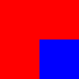
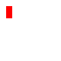
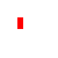
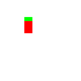
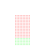
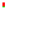
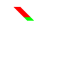
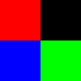

# 2D graphics in C

This is a project/documentation about my findings for 2d graphics. 

I'm doing this because I think C is cool, and I think 2d graphics is interesting - there's a lot of linear algebra.

## Color and pixels

The color model that most computers work with (sort-of, I'm actually not super knowledgable in this) is an additive color model, with the base colors being red, green, and blue. 
A pixel is made of a 3-tuple of these colors to light up a portion of the screen. Adding more colors together would make something lighter, and adding all of them together makes white. The absence of any color leaves a black pixel. 

A pixel uses a tuple of RGB, with a possible 4th value for 'alpha' (basically transparency). Each color has a 'depth' which is how many possible values there are for that color.
e.g. if a pixel had a red depth of 2, then the pixel could either be red or not. I'm going to use 1 byte for each color for each pixel, mostly because I'm making small images and just testing stuff out, but trying different values can be interesting.

In this project, a pixel will be a 4-tuple with values ranging from 0-255 (or 0 - 0xFF in hex). This means that a pixel will take up to 4 bytes (32 bits) which is a little big. 

And as a side note, an alpha of 255 is not transparent and an alpha of 0 is fully transparent.

## Coordinates 

Computer graphics coordinate systems are slightly different than what I'm used to. 

The top-left corner of the screen is the origin, and then the bottom-right is the (MAX_X, MAX_Y) coordinate, depending on the resolution of the screen. 

## Graphics file format

The final topic for the initial commit is picking a graphics file format. I want to be able to write out to a file to generate an image (I'm developing remotely over SSH, so I can't just see the image on the screen). I did a very small amount of research, found an open standard which seems really easy to write (the PAM format).  

### PAM file format
The pam format is a relatively easy format to write. It has a simple header and then a blob of data to represent the image. More information about the header can be found here: http://manpages.ubuntu.com/manpages/bionic/man5/pam.5.html

The downsides of the PAM format is almost no image tools support this format (not even GIMP!). You'll need to fiddle around with the [netpbm package](http://netpbm.sourceforge.net/) to install the conversion tools.

There's a converter util to convert these files to png files called pamtopng which can be found as part of the netpbm package. See [pamtopng](https://manpages.debian.org/experimental/netpbm/pamtopng.1.en.html).

I didn't go with some of the more standard file formats (bmp, png) as the header is kind of complicated and they're kind of tricky to write.

## Pixel struct

I'm using a simple struct to represent a pixel. Its a more object-oriented approach (which I'm more familiar with) and you can do stuff like pixel.red / pixel->red instead of pixel\[RED\]. 
The downside of doing it this way is that it it makes it harder to do vectorized optimizations to the algorithms. I'm not super worried about this because I'm already doing a ton of unoptimized stuff - e.g. the PAM file format I'm using is pretty inefficient. 

## Image

I've defined an image struct, which has a width, height and then an array of pixels to store the actual image definition.

I've updated the definition of the write_pam_file API to take in a path and an image, as the image has enough information for it to be serialized (and also I've updated some of the naming).

I've also created 3 functions. 2 of them are util functions and 1 is mostly a test function
* `make_filled_image` - creates an image filled with a single color
* `copy_image` - creates a copy of an image. This is really useful as a lot of my functions will be destructive (basically any function that doesn't take in a const can and probably will mutate the input paramters)
* `fill_section` - fills a section of an image. This is for testing that the coordinate system is correct. 

The code in [main.c](./src/main.c) outputs two images:
* The original image

  

  You can see that its 3/4 red with the bottom-right corner being blue. This is great, as it means that the coordinate system is working
* The copy of the image before it was modified 
  
  
  
  Its not modified. This is also great, this means that the copy function is working. Now if images are magically getting changed, its because I didn't make a copy before doing a mutating operation on it. 

## Color operations

Pixels can be thought of as 3-Vectors (the linear algebra vector) in color space, with red, green and blue being the orthogonal basis vectors.

The two basic vector operations are:
* add two vectors (and I'll need to do special work for subtraction since I'm using unsigned values)
* multiply the vector by a constant (and more work needs to be done to support division, since I'm using non-floating point numbers).

### Sidenote - overflow and underflow

One thing that I need to keep in mind is over and underflow. 

I'm using unsiged 8-bit ints for representing my colors and due to how math works on computers, adding two numbers that would be greater than 2^8 - 1 would result in the operation "overflowing" and wrapping around. See the below example.

```
x = 150; //10010110
y = 150; //10010110

Adding these together would get:
100101100, but the most significant bit gets chopped off as you can only keep 8, so you end up with 00101100 [44]
```

I think in image processing you usually clamp at the max/min values, so this overflow behavior is not desired. Instead I need to define special math functions that check for over and underflows and prevent this, instead just returning the max or the minimum. 

I've created fun custom functions for this (which are probably quite ineffecient) in [math.c](./src/math.c). I've also written a bunch of test cases for these in [test_math.c](./tst/test_math.c) which I belive is quite important, because it would be really hard to debug bugs with addition or subtraction.

I've created a simple test script in main, and outputed the image. It looks like:


Which is great! Its multiplying and adding pixel values. 

## Clipboard operations 

As part of the mspaint operations (going from left-to-right on the UI), the first ones are copy and paste. 

* paste_to_image
* copy_from_image

These are pretty boring to implement, they just are bitwise copy and bitwise select operations. 

Outputted images can be found here:


# Linear algebra

## Matrix operations on pixels

Pixels can be thought of as 3 or 4 vectors (depending on whether you want to keep the alpha value). This means that you can use linear algebra and matrix multiplication to do various operations.

Some of them are as follows:

|Use case | Matrix | Description |
|--|--|--|
|Do nothing | [1 0 0]</br>[0 1 0]</br>[0 0 0] | Use the identity matrix to do nothing |
|Get the value of a specific channel| [1 0 0]</br>[0 0 0]</br>[0 0 0] | Just gets the red channel |
|Greyscale conversion | [1 1 1]</br>[1 1 1]</br>[1 1 1] | Sums up the RGB channels and then distributes the values to each channel (you also need to divide by 3) |
|Reverse colors | [0 0 1]</br>[0 1 0]</br>[1 0 0] | Reverses the R and B color values |

Output colors can be found below:

  

## Matrix operations on images

I also want to be able to support pixel operations on images. This can be done pretty easily in C by passing a function pointer.

### Affine Transforms

Affine transformations are matrix operations on an image, but they act on the pixel locations instead of the pixel color values. 

Below are the following main types of affine transforms

| Type | Matrix | Description | Image |
|--|--|--|--|
|Identity | [1 0 0]<br/>[0 1 0]<br/>[0 0 1]<br/> | Returns the same |  |
| Translation | [1 0 Vx]<br/>[1 0 Vy]</br>[0 0 1] | Translates each pixels over by (Vx, Vy) | |
| Reflection | [-1 0 0]<br/>[0 1 0]<br/>[0 0 1] | Reflects the image over the X axis |  |
| Scale | [2 0 0]<br/>[0 1 0]<br/>[0 0 1] | Doubles the image on the X axis |  |
| Rotate | [cos(x) -sin(x) 0]<br/>[sin(x) cos(x) 0]<br/>[0 0 1]<br/> x=PI/4| rotates the image by x | |
| Shear | [1 x 0]<br/>[0 1 0]<br/>[0 0 1] OR <br/> [1 0 0]<br/>[y 1 0]<br/>[0 0 1] | Shears each point. You need to use matrix multiplication to shear on two axis with one matrix  | |

If you want to apply multiple transforms, then you can multiply the matrixes together. The operation is `T1 * T2 * v`, which can be performed as both `(T1 * (T2 * v))` or `((T1 * T2) * v)`.

There seems to be one issue - mapping from the original location to the destination location seems to create a lot of empty space when scaling up (or rotating by a non-90 degree increment or sometimes by shearing). I want to try inverting the matrix and then converting from dest to source location. 

### Kernels in Image Processing

Kernels can be used in image processing to do blurring, sharpening, embossing, and edge detection. This is accomplished by doing a convolution between an image and a kernel.

Below are the following kernel transforms I've tested

|Operation|Kernel|Image|
|--|--|--|
|Identity|[0 0 0]<br/>[0 1 0]<br/>[0 0 0]|  |
|Box blur | [1 1 1]<br/>1/9 * [1 1 1]<br/>[1 1 1] |  |
|Gauss blur | [1 2 1]<br/>1/16 * [2 4 2]<br/>[1 2 1] |  |
|Sharpen | [0 -1 0]<br/>[-1 5 -1]<br/>[0 -1 0]<br/> |  |

Edge detection can also be performed, though I used a greyscale image for this:

 

The edge detection algorithm highlights only sections where there is a transition from one color to the next.

There is a slight implementation defect in the kernel transforms where I didn't account for the edges, but they can be removed after the fact, by selecting (1,1) to (width-1, height-1). Other ways to fix it would be to either mirror or wrap the pixels in the image.

# TODOs
* tests
* alpha blending and layers
* different color models (hsv)
* vector graphics and basic shapes (line, square circle, triangle, polygon)
* vector graphics - functions and curves
* antialiasing
* interpolation
* gradients (linear and radial)
* store images as jpgs
* clean up readme
* clean up git history

# Bugs/Issues
* kernel processing is slightly bad (it just ignores the pixels on the edge)
* For the affine transformations I want to try going from new location to old location. Right now I have old location to new location, so I need to invert the matrix.

# Learnings
* Using uint8_t for the base matrix/vector is not great. Spent a lot of time debugging issues with that. I'm really missing generics now...
* Not having tests/good tests is now coming back and bugging me - I wanted to refactor the copy_from_image code (I think there's a bug in it), but I don't want to break it and/or write a small test for it now. 
* As hack as it is, using valgrind to find the stacktrace for where the core dump is coming from is really useful (I should be using `gdb` for this, but its not that important right now).
* Take breaks. Debugging C gets really hard if you're tired. 