# 2D graphics in C

This is a project about 2D graphics, with a library of functions written in C and with some demo-scripts written in lua, though there is a possiblity of generating the C/native bindings in different languages.

The primary purpose of this was to learn about graphical methods and learn about modern C, though I'm professionally a java programmer, so a lot of the code probably looks like java. 

# Setup 
Basic C build tools are required. 

On Ubuntu the command to run is `sudo apt-get install build-essentials` to download gcc (the C compiler tested against).

## Dependencies
The other dependencies for the project are: 

* lua 5.2 - for running the lua scripts 
* libjpg - for reading jpgs and writing images as jpgs
* libpng - for reading pngs and writing images as pngs 
* clang-format (only for formatting) and clang-lint (for linting)
* swig 4.0.2 - for generating the lua bindings for running the lua scripts

In theory its possible for this to run without these dependencies, but some stuff will need to be cleaned up/removed.

## IDE 

I recommend installing `VS Code` since its both pretty light-weight, but also has plugins for C. 
`vim` is another alternative. 

## Setup commands

The simplest command to build everything is `make all` which will compile and link all files. The outputted binary can be run with `./bin/graphics`. 

`make everything` will also build the lua bindings and `make target` will also run the formatter and linter. You can run all the sample lua scripts by running `./run_lua_scripts.sh`. 

# Image basics 

## Color and pixels

The color model that computers work with is an additive color model, with the base colors being red, green, and blue. 
A pixel is made of a 3-tuple of these colors to light up a portion of the screen. Adding more colors together would make something lighter, and adding all of them together makes white. The absence of any color leaves a black pixel. 

A pixel uses a tuple of RGB, with a possible 4th value for 'alpha' (basically transparency). Each color has a 'depth' which is how many possible values there are for that color.
e.g. if a pixel had a red depth of 2, then the pixel could either be red or not. I'm going to use 1 byte for each color for each pixel, mostly because I'm making small images and just testing stuff out, but trying different values can be interesting.

In this project, a pixel will be a 4-tuple with values each element value rangings from 0-255 (or 0 - 0xFF in hex).  
This means that a pixel will take up to 4 bytes (32 bits) which is a little big. 

And as a side note, an alpha of 255 is not transparent and an alpha of 0 is fully transparent.

| Description | Pixel Values | Example image |
|--|--|--|
|Red|(255, 0, 0, 255)||
|Blue|(0, 255, 0, 255)||
|Green|(0, 0, 255, 255)||
|Grey|(128, 128, 128, 255)||
|Half transparent grey|(128, 128, 128, 128)||
|Black|(0, 0, 0, 255)||
|White|(255, 255, 255, 0)||

### Implementation - Pixel struct

I'm using a simple struct to represent a pixel. Its a more object-oriented approach (which I'm more familiar with) and you can do stuff like pixel.red / pixel->red instead of pixel\[RED\]. 
The downside of doing it this way is that it it makes it harder to do vectorized optimizations to the algorithms. I'm not super worried about this because I'm already doing a ton of unoptimized stuff - e.g. the PAM file format I'm using is pretty inefficient. 

the implementation can be found in [pixel.h](./src/pixel.h#11). Its not the greatest practice to have the struct definition (it leaks the implementation of the struct) in the header files, but in this case I think its fine - its not going to change, and it makes it easier to use the pixel objects from an API consumer viewpoint. The only downside of my approach is if I want to change the struct later - like if I wanted to convert it to an array-based implementation as I would not easily be able to do the change. 

## Color operations

Pixels can be thought of as 3-Vectors (the linear algebra vector) in color space, with red, green and blue being the orthogonal basis vectors.

The two basic vector operations are:
* add two vectors (adding two pixel values together by color, so p1.red + p2.red, p1.blue + p2.blue...)
* multiply the vector by a constant 

There are also additional operations that I've added support for: multiplying the color values by a matrix. 

Multiplying a pixel by a matrix is used in simple white balance algorithms. This is to correct for weird lighting (or to make weird lighting) e.g. if everything has a small red tint, you can multiply by a matrix like:

```
0.9 0 0
0   1 0
0   0 1
```

to correct for it

Below are simple pixel operations

| Description | Operation (all use 255 as alpha) | Image |
|--|--|--|
|Adding red and green | (255, 0, 0) + (0, 255, 0) |  |
|Adding red, green and blue | (255, 255, 0) + (0, 0, 255) |  |
|Subtracting green from white|(255, 255, 255) - (0, 255, 0) |  |
|Dividing bright purple by 2| (255, 255, 0) / 2|  |

Below are matrix pixel operations

|Description|Original Pixel Value (all alpha = 255)|Original image|Transformation Matrix|Transformed Pixel Value| Transformed Image|
|--|--|--|--|--|--|
|No change (identity)|(255, 255, 255)||1 0 0<br/>0 1 0<br/>0 0 1|(255, 255, 255)||
|Greyscale projection|(0, 255, 255)| | 1/3 1/3 1/3<br/>1/3 1/3 1/3<br/>1/3 1/3 1/3| (170, 170, 170)| |
|Swap colors (R&G)|(0, 255, 255) | | 0 1 0<br/>1 0 0<br/>0 0 1<br/> | (255, 0, 255) |  |
|Filter color (Only select G&B) | (255, 255, 255)| | 0 0 0<br/>0 1 0</br>0 0 1<br/>| (0, 255, 255) |  |
|Rebalance colors (decrease red, increase blue)| (128, 128, 128) |  | 1/2 0 0<br/>0 1 0<br/>0 0 3/2 | (64, 128, 192) |  |

The matrix pixel operations can also be combined. In Linear Algebra terms whats happening is we're taking matrix A and multiplying pixel p by it (so output_color = A * p). You can make a new matrix C by multiplying matrices A and B that can do both transformations in 1 step (though since its matrix multiplication order matters and A * B doesn't always equal B * A).

|Description|Original Pixel Value (all alpha = 255)|Original image|Transformation Matrix|Transformed Pixel Value| Transformed Image|
|--|--|--|--|--|--|
|Filter (R&B) then greyscale|(128, 128, 128)| | 0 1/3 1/3<br/>0 1/3 1/3<br/>0 1/3 1/3<br/>| (83, 83, 83) | |
|Greyscale then filter|(128, 128, 128)| | 0 0 0<br/>1/3 1/3 1/3<br/>1/3 1/3 1/3<br/>| (0, 128, 128) | |


The matrix operations can also be inverted. There are some conditions for inverting a matrix but if these hold then you can reverse a pixel matrix transformation. 

Mathematically the inverse of matrix A is A^-1, with the property that A * A^-1 = I (the identity matrix) and A * A^-1 * v = v. 

As a rule of thumb as long as there's no information loss, the matrix is invertable. The matrixes to rebalance color and swap color channels are invertable but the matrixes to filter out a channel and convert to greyscale are not invertable.

* filtering a color is not invertable because all the information about the original value in that channel is erased. After filtering out red (multiplying by 0), you have no idea what the original red value was.
* converting to greyscale is not invertable if the weights are the same (like in my example where I used 1/3 for all values in the matrix). This is because you can't tell what the original value was.

Below is the matrices and images for the swapping R&G channels and the inverse.
|Original image|Transformation matrix |Transformed image|Inverse transformation matrix|Inverse image|
|--|--|--|--|--|
||0 1 0<br/>1 0 0<br/>0 0 1<br/>|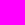|0 1 0<br/>1 0 0<br/>0 0 1||

And if you double check, multiplying the Transformation matrix by the inverse transformation matrix will produce the identity matrix. 


### Implementation - signed, unsigned, overflow and underflow

One thing to keep in mind is over and underflow (and signed-ness of bits)

I'm using unsiged 8-bit ints for representing my colors and due to how math works on computers, adding two numbers that would be greater than 2^8 - 1 would result in the operation "overflowing" and wrapping around. See the below example (assuming little endian).

```
x = 150; //10010110
y = 150; //10010110

Adding these together would get:
100101100, but the most significant bit gets chopped off as you can only keep 8, so you end up with 00101100 [44]
```

In image processing you clamp at the max/min values, as this overflow behavior is not desired. I defined special math functions that check for over and underflows the max or the min value for the color (255 or 0 respectively). 

I've created fun custom functions for this (which are probably quite ineffecient) in [math.c](./src/math.c).

## Alternative color spaces

Color spaces are the ways of representing the colors as a tuple. The most common color space (to lay-people and me) is probably RGB, where the elements in the tuple represent the amount of red, green and blue of the pixel.

There's other color spaces though, with one example being HSV.

The HSV model is supposed to more accurately match with how humans see color. 

The hue value is the color portion of the model, with values between 0 and 360 degrees. 

Saturation is a percentage value (between 0 and 100, or 0 and 1) which is the amount of "color" in the color. 0 represents grey and 1 (or 100) represents.

Finally the value part of the model is a percentage and represents the brightness of the pixel. 0 is completely black and 1 is completely white. 

There's other color models, with other pros/cons (e.g. CMY (cyan, magenta, yellow) which is used in printers) but I'm not going to implement those. 

| HSV Value | Pixel (RGB) Value | Image |
|--|--|--|
|360, 1, 1|255, 0, 0| 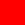|

## Images, coordinates and raster graphics 

Images can be made up of a collection of shapes (vector graphics) or a collection of pixels (raster graphics). 

Raster graphics are somewhat more common as a lot of image sensors (like in digital cameras) are made up of rows and columns of pixels. See below for an example matrix: with pixel, x-coord, y-coord.

```
p00 p01 p02
p10 p11 p12
p20 p21 p22
```

## Images

I've defined an image struct, which has a width, height and then an array of pixels to store the actual image definition.

Images have these basic crud operations:
* make_filled_image - creates an image filled with pixels of a certain color
* write_pixel_to_image / get_pixel_from_image - reads or writes a specific pixel to/from an image
* paste_to_image / copy_from_image - reads or writes an image from or onto an image.
* transform_pixels - applies a pixel transformation (as in the Pixel section) to all pixels in an image

### Image struct

The Image struct is straightforward - its just a max_width, max_height and an array of pixels. See [image.h](./src/image.h#13) for the implementation. Its recommended to create images through the `make_filled_image` as its a little fiddly to set up the object correctly. 

## Graphics file format

A little bit out of place, but next up is graphics file formats. We've got to be able to store the image someplace so that it can be seen. There are libraries to do live previews, but they're slightly heavy-weight (libsdl2 is an example).

### PAM 
The pam format is a relatively easy format to write. It has a simple header and then a blob of data - the image as bits stored directly in a file. 

An example header can be seen below:

```
P7
WIDTH 100
HEIGHT 100
DEPTH 4
MAXVAL 255
TUPLTYPE RGB_ALPHA
ENDHDR
```

The code to write pam files can be found in [file_pam.c](./src/file_pam.c#24)

There are two main downsides for this image format: 
1. Almost no image tools support this format (not even GIMP!). You can set up the [netpbm package](http://netpbm.sourceforge.net/) to install the conversion tools. There's a converter util to convert these files to png files called pamtopng which can be found as part of the netpbm package - see [pamtopng](https://manpages.debian.org/experimental/netpbm/pamtopng.1.en.html). Alternatively you can use my [script](./lua/pamtopng.lua) to convert the pam files to pngs.  
1. Additionally there's no compression so the file sizes are giant! A 10x10 image is ~500 bytes, compared to a png which is ~100 bytes. Because the image sizes are small, the lack of compression is not that bad, but it gets worse at 100x100 images. At 100x100 the png is still a reasonable 314 bytes, but the PAM file is 40KBytes.

More information about the format can be found here: http://manpages.ubuntu.com/manpages/bionic/man5/pam.5.html

### BMPs (not supported)

I haven't added support for BMPs because the header is pretty complicated. They're actually pretty similar to PAM files, but they have a much more complicated header format, and depending on some of the flags in the header, the data can be compressed. 

The header consists of:
```
BITMAPFILEHEADER - 14 bytes
DIBMAPV5HEADER - there's 5 versions 
(Optional) COLORTABLE - Stores color mappings (if they're used)
PIXELARRAY - the actual data for the image
ICCCOLORPROFILE
```

Anyways, due to the headers they're pretty complicated to implement, and since I'm only using 24bit RGBA pixels, its not really worth the time. 

### JPEGs

The JPG (or jpeg) file format is a lossy-compressed image format meaning that some data will be lossed on save. It follows a complicated algorithm that uses the Discrete Cosine Transform (similar to a fourier transform, but only uses cosines), quantization, and compression.

Its super fiddly to implement, so I just pulled in `libjpg` to do the heavy lifting. 

### PNGs

PNGs are different from JPGs since the have lossless-compression instead of lossy, but they're even more complicated. 

Its also really hard to implement, so I pulled in `libpng` to do the file writing/reading. 

## Alpha Blending

Alpha blending is the process of combining translucent foreground and background images which produces a new image. 

This is done by taking the foreground images transparency "alpha value" and combining it with its RGB values and then combining those values with the background images RGB & alpha values. 

The formula for this computation is in the alpha_blend method in [image.c](./src/image.c#246).

|Description|Image|
|--|--|
|Unblended red image| 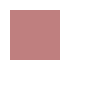|
|Unblended green image| 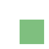|
|blended green onto red | 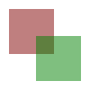 |
|blended red onto green | 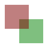 |

## Image masking

For some reason I decided to implement image masking.  Its a simple algorithm, it just DFSes the image, checking if the pixel_filter condition is still true. 

The comments in the header are actually pretty good, so I'd recommend checking it out. Example usage can be found in the `11_image_mask.lua` file.

[image_mask.h](./src/image_mask.h)

[11_image_mask.lua](./lua/11_image_mask.lua)

## Image pixel operations

Images support the pixel operations. The operation will be applied to all pixels in that image. 

They are the `transform_pixels_other` and the `transform_pixels_matrix` methods. 

```
-- example matrix operation (in lua)
lib.transform_pixels_matrix(image, matrix, scaling_const)

-- example pixel operation (in lua)
lib.transform_pixels_other(image, lib.fptr_pixel_add(), new_pixel)
```

# Geometric operations on pixel locations

A geometric operation on an image moves the pixels on an image to a different location. 

There are 5 base operations:
* scale - change the size of the image
* rotate - rotate the image 
* reflect - flip the image contents
* shear - displace each point proportional to how far its from the origin
* translate - move the image contents

These base operations can be performed using linear algebra.

## Linear Transformations

Linear transformations are matrix operations that can cover the first 4 geometric operations. They are implemented by multiplying each pixel location by a 2x2 matrix - so **p_new_position** = A * **p_old_position**:
```
|p_x_new| = |A B| * |p_x_old| 
|p_y_new|   |C D|   |p_y_old|
```

Scale, rotate, reflect, and shear operations can be implemented with linear transformations but you can't implement translation operations using linear transforms - for that you need to use affine transformations. 

## Affine Transforms

Affine transformations are similar to linear transformations, but they use 3x3 matrices instead of 2x2 matrices. Additionally, there is a 3rd component added to the pixel location - almost like a 'z' component, but its just the constant '1'.

So the pixel location vector goes from `(p_x, p_y)` to `(p_x, p_y, 1)`. 

Below are the generic matrices used for affine transformations: 

| Type | Matrix | Description |
|--|--|--|
| Identity | 1 0 0<br/>0 1 0<br/>0 0 1<br/> | Does nothing, returns the same image |
| Translation | 1 0 Vx<br/>0 1 0 Vy</br>0 0 1 | Translates each pixels over by (Vx, Vy) | 
| Reflection | X 0 0<br/>0 Y 0<br/>0 0 1 | X, Y values can be +1 or -1. It will flip over the axis of the negative values |
| Reflection over angle | cos(2x) sin(2x) 0<br/>sin(2x) -cos(2x) 0<br/>0 0 1 | reflect over line with degrees x from origin |
| Scale | X 0 0<br/>0 Y 0<br/>0 0 1 | X, Y are positive constants. Values less than 1 will shrink the image and values greater than 1 will stretch the image |
| Rotate | cos(x) -sin(x) 0<br/>sin(x) cos(x) 0<br/>0 0 1<br/>| rotates the image by x degrees counterclockwise | |
| Shear | 1 x 0<br/>0 1 0<br/>0 0 1 OR <br/> 1 0 0<br/>y 1 0<br/>0 0 1 | Shears each point - . You need to multiply the matrices to get both X and Y shear, changing both of the constants will make a weird transformation matrix |

Below are some example images:
|Description|Matrix|Image|
|--|--|--|
|Identity|1 0 0<br/>0 1 0<br/>0 0 1<br/>|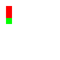|
|Translate left 20 and down 30| 1 0 20<br/>0 1 30<br/>0 0 1|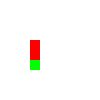|
|Reflection over y (also requires some translation to get the image to be in frame)|1 0 0<br/>0 -1 0<br/>0 0 1| 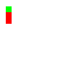|
|Rotate 90 degrees|0 -1 0<br/>1 0 0<br/>0 0 1<br/>|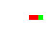|
|Rotate 45 degrees|cos(45) -sin(45) 0<br/>sin(45) cos(45) 0<br/> 0 0 1<br/>|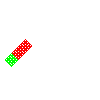|
|Shear x|1 1.2 0<br/>0 1 0<br/> 0 0 1<br/>|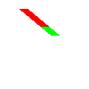|
|Shear y|1 0 0<br/>1.2 1 0<br/>0 0 1|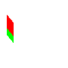|
|Shear x and y|2.44 1.2 0<br/>1.2 1 0<br/>0 0 1|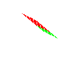|
|Scale - shrink y|1 0 0<br/>0 0.5 0<br/>0 0 1|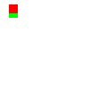|
|Scale - stretch x and y (see below)|1.5 0 0<br/>0 1.5 0<br/>0 0 1|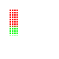|


If you want to apply multiple transforms, then you can multiply the matrixes together. The operation is `T1 * T2 * v`, which can be performed as both `(T1 * (T2 * v))` or `((T1 * T2) * v)`.

One thing to note is that I named the functions `affine_transformation` in image.h/image.c. These methods actually take in any matrix, not just affine matrices, so they're slightly misnamed. 

There seems to be one issue - mapping from the original location to the destination location seems to create a lot of empty space when scaling up. This issue is caused because we're taking the old pixel location, modifying it and then putting it on the image in a new location. The problem is sometimes there is no pixel being mapped in the new location (like in the case of rotation where multiple old locations can get rounded to the same new location or with scaling when you double the size, then there is no old location for all odd coordinations in the new image).
  
## Better image scaling functions

To fix the mapping issue mentioned in the above affine transformation section, instead of having `A * p_old = p_new`, the new locations can be determined by inverting the matrix and then looking up the location in the old image - so `A^-1 * p_new = p_old`. It would end up having the same issue if there's no clear mapping back but there's a couple strategies if there's no clear mapping. 

Below are some example images:
|Description|Matrix|Image|
|--|--|--|
|Identity|1 0 0<br/>0 1 0<br/>0 0 1<br/>||
|Translate left 20 and down 30| 1 0 20<br/>0 1 30<br/>0 0 1||
|Reflection over y (also requires some translation to get the image to be in frame)|1 0 0<br/>0 -1 0<br/>0 0 1| |
|Rotate 90 degrees|0 -1 0<br/>1 0 0<br/>0 0 1<br/>||
|Rotate 45 degrees|cos(45) -sin(45) 0<br/>sin(45) cos(45) 0<br/> 0 0 1<br/>||
|Shear x|1 1.2 0<br/>0 1 0<br/> 0 0 1<br/>||
|Shear y|1 0 0<br/>1.2 1 0<br/>0 0 1||
|Shear x and y|2.44 1.2 0<br/>1.2 1 0<br/>0 0 1|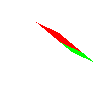|
|Scale - shrink y|1 0 0<br/>0 0.5 0<br/>0 0 1||
|Scale - stretch x and y (see below)|1.5 0 0<br/>0 1.5 0<br/>0 0 1|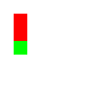|

Only Nearest neighbor is currently implemented though there are other interpolation methods when there is no clean 1:1 mapping between the old pixel location and the new pixel location - some are linear, bilinear, and bicubic (I believe that bicubic is the most commonly used right now)

### Kernels in Image Processing

One more way to use linear algebra in image processing is with kernel transforms. A kernel transform will take a pixel and combine it with its neighbors. Kernels can be used in image processing to do blurring, sharpening, embossing, and edge detection. 

If you have an image with the pixels indexed by p(x, y) and a 3x3 matrix with components A(x,y), then a kernel transformation would have:

`p_new(x,y) = A(0, 0) * p(x-1, y-1) + A(1, 0) * p(x, y-1) + A(2, 0) * + A(1, 0) * p(x-1, y) + A(1, 1) * p(x,y) + ... `

Below are the following kernel transforms I've tested

|Operation|Kernel|Image before|Image after|Description|
|--|--|--|--|--|
|Identity|0 0 0<br/>0 1 0<br/>0 0 0| 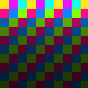 |  |The identity transformation does not modify the image (its just included for demonstration)
|Box blur | 1/9 1/9 1/9<br/>1/9 1/9 1/9<br/>1/9 1/9 1/9|  | 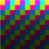 |Box blur will blur together adjacent pixels|
|Gauss blur | 1/16 2/16 1/16<br/>2/16 4/16 2/16<br/>1/16 2/16 1/16<br/> |  | 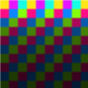 | Gaussian blur will blur together adjacent pixels, but they will be weighted by a gaussian distribution |
|Sharpen | 0 -1 0<br/>-1 5 -1<br/>0 -1 0<br/> |  | 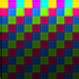 | Sharpening an image will undo a blurring effect, making the edges appear more distinct |
|Edge detection | -1 -1 -1<br/>-1 8 -1<br/>-1 -1 -1<br/> |  | 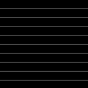 | Edge detection is like extreme image sharpening. The kernel performs a derivative, subtracting the pixel value from its neighbors, so only pixels that are different from their neighbors will end up post-transform | 

There is a slight implementation defect in the kernel transforms where I didn't account for the edges, but they can be removed after the transformation by selecting (1,1) to (width-1, height-1). Other ways to fix it would be to either mirror or wrap the pixels in the image.

# Vector graphics and rasterization

Vector graphics are a different way of representing images. I've currently been representing images as a 2D array of pixels (called raster graphics). Its easy and flexible, but requires a lot of memory, and doesn't always provide the easiest API to work with if you want to draw shapes.

Another way of representing images is with a collection of shapes, called vector graphics. These primarily have the advantage of being scalable to any size with no aliasing. They may also take less storage space if the image is made out of simple shapes. The downside of vector graphics is that most digital image capture technology does not capture vector images (i.e. a digital camera captures an array of 2D pixels).

The basic shapes that should be supported are:
* lines and squares
* circles and arcs

and there is a process - called `rasterization` that converts from the vector (shape) format to the raster (pixel-map) format in which I'll be looking into multiple methods to do this conversion.

## Algorithms

Description of the algorithms can be found in the [shape.h](./src/shape.h) file. 

## Polygons

Arbritrary polygons can also be drawn. My implementation treats polygons as a collection of line segments and they're drawn such that the end of the previous segment is the start of the next segment. Additionally, since they're pretty finicky to set up I actually followed ok C practice and hid the implementation of the polygon type (though this is actually also not good, since it doesn't allow end-users to extend polygons beyond the simple triangle and rectangle polygons I supports)

## Images

|Description|Image|
|--|--|
|Random lines|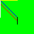|
|Circles|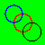|
|Arcs|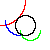|
|Polygons|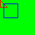|

# Programming languages and tools used

## C 

## Lua

## Swig

# TODOs
## Linear algebra
* interpolation - for affine transforms - nearest neighbor, linear, bilinear, bicubic.
* method to "add/subtract" two images from each other, applying a pixel operation across the two images. 
* the geometric transformation API is hard to use, it would be nice to wrap the matrix operations in easier-to-use methods. (so rotate, translate, scale, shear, reflect methods)

## Vector graphics
* midpoint based optimized algorithm for drawing arcs
* draw filled images - shape.h methods
  * solid and gradients (linear and radial) fill
* aliasing and antialiasing for shapes

## Polishing and productionization
* clean up git history
* clean up lua scripts
* finish unit tests
  * Its much easier to see if a function generates the right image than it is to read the tests, so it might be easier to have image comparison test cases
* the uint_8 matrix operations are kind of limited and should eventually be replaced with double matrix operations

